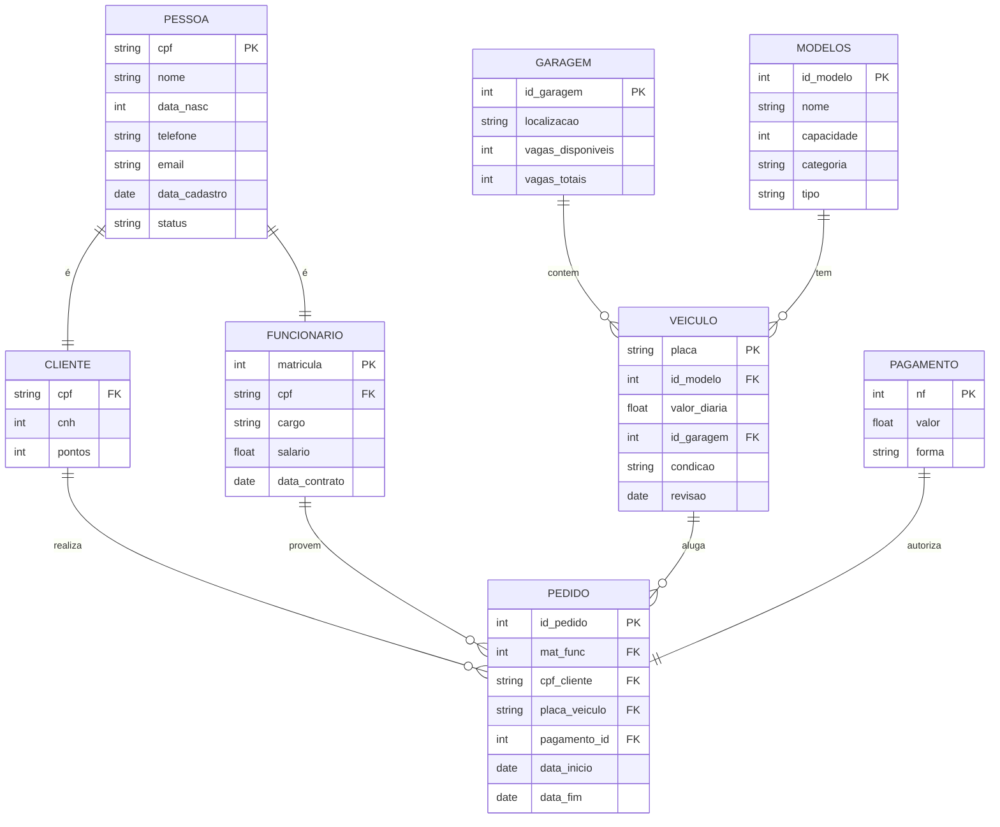

# alucar
Projeto universidade São Lucas para banco de dados e programação orientada a objetos

```mermaid
    erDiagram

PESSOA {
    string cpf PK
    string nome
    int data_nasc
    string telefone
    string email
    date data_cadastro
    string status
}

CLIENTE {
    string cpf FK
    int cnh
    int pontos
}

FUNCIONARIO {
    int matricula PK
    string cpf FK
    string cargo
    float salario
    date data_contrato
}

VEICULO {
    string placa PK
    int id_modelo FK
    float valor_diaria
    int id_garagem FK
    string condicao
    date revisao
}

MODELOS {
    int id_modelo PK
    string nome
    int capacidade
    string categoria
    string tipo
}

GARAGEM {
    int id_garagem PK
    string localizacao
    int vagas_disponiveis
    int vagas_totais
}

PAGAMENTO {
    int nf PK
    float valor
    string forma
}

PEDIDO {
    int id_pedido PK
    int mat_func FK
    string cpf_cliente FK
    string placa_veiculo FK
    int pagamento_id FK
    date data_inicio
    date data_fim
}
PESSOA ||--|| CLIENTE : "é"
PESSOA ||--|| FUNCIONARIO : "é"

GARAGEM ||--o{ VEICULO : contem
MODELOS ||--o{ VEICULO : tem

CLIENTE ||--o{ PEDIDO : realiza
FUNCIONARIO ||--o{ PEDIDO : provem
VEICULO ||--o{ PEDIDO : aluga

PAGAMENTO ||--|| PEDIDO : autoriza

```

