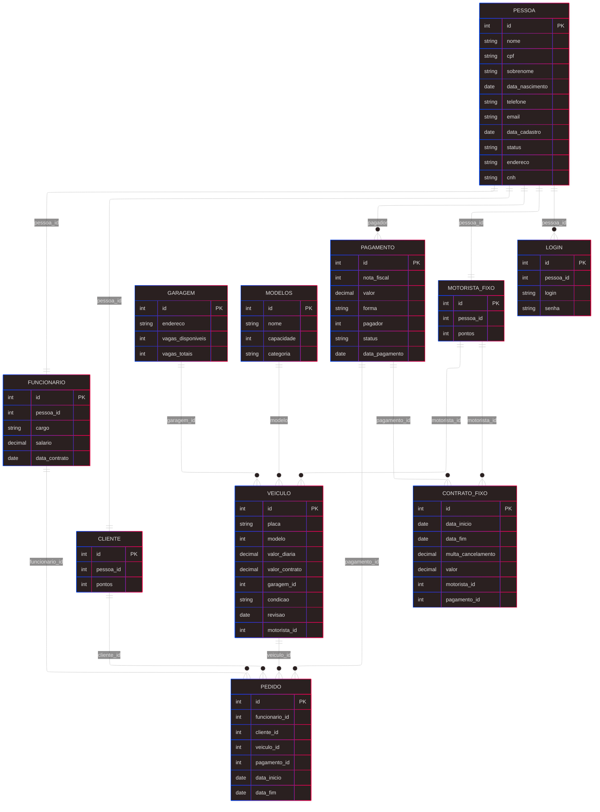

```mermaid
---
config:
  layout: elk
  look: neo
  theme: neo-dark
---
erDiagram
    PESSOA {
        int id PK
        string nome
        string cpf
        string sobrenome
        date data_nascimento
        string telefone
        string email
        date data_cadastro
        string status
        string endereco
        string cnh
    }

    GARAGEM {
        int id PK
        string endereco
        int vagas_disponiveis
        int vagas_totais
    }

    MODELOS {
        int id PK
        string nome
        int capacidade
        string categoria
    }

    PAGAMENTO {
        int id PK
        int nota_fiscal
        decimal valor
        string forma
        int pagador
        string status
        date data_pagamento
    }

    MOTORISTA_FIXO {
        int id PK
        int pessoa_id
        int pontos
    }

    FUNCIONARIO {
        int id PK
        int pessoa_id
        string cargo
        decimal salario
        date data_contrato
    }

    CLIENTE {
        int id PK
        int pessoa_id
        int pontos
    }

    VEICULO {
        int id PK
        string placa
        int modelo
        decimal valor_diaria
        decimal valor_contrato
        int garagem_id
        string condicao
        date revisao
        int motorista_id
    }

    CONTRATO_FIXO {
        int id PK
        date data_inicio
        date data_fim
        decimal multa_cancelamento
        decimal valor
        int motorista_id
        int pagamento_id
    }

    PEDIDO {
        int id PK
        int funcionario_id
        int cliente_id
        int veiculo_id
        int pagamento_id
        date data_inicio
        date data_fim
    }

    LOGIN {
        int id PK
        int pessoa_id
        string login
        string senha
    }

    PESSOA ||--o{ PAGAMENTO : pagador
    PESSOA ||--|| MOTORISTA_FIXO : pessoa_id
    PESSOA ||--|| FUNCIONARIO : pessoa_id
    PESSOA ||--|| CLIENTE : pessoa_id
    PESSOA ||--o{ LOGIN : pessoa_id

    GARAGEM ||--o{ VEICULO : garagem_id
    MODELOS ||--o{ VEICULO : modelo

    MOTORISTA_FIXO ||--o{ VEICULO : motorista_id
    MOTORISTA_FIXO ||--o{ CONTRATO_FIXO : motorista_id

    PAGAMENTO ||--o{ CONTRATO_FIXO : pagamento_id
    PAGAMENTO ||--o{ PEDIDO : pagamento_id

    FUNCIONARIO ||--o{ PEDIDO : funcionario_id
    CLIENTE ||--o{ PEDIDO : cliente_id
    VEICULO ||--o{ PEDIDO : veiculo_id
```
